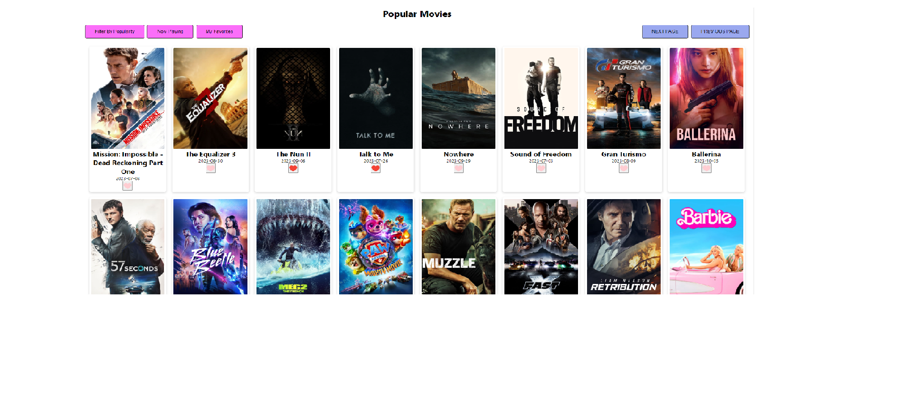

# Movies Application

Movies app that shows popular movies, now playnig movies and user favorites movies.

## Overview

By using this app users can:

- See all the popular movies
- See what movies are currently showing
- Mark the selected movie as a favorite
- Filter the results in home page by popular movies, now palying and favorite movies
- Insert inside movie card to see movie details

### Screenshots

## Built with

- Creat React App
- Themoviedb APIs
- Axios for making HTTP Requests
- Css for design

## How to run the project

1. Clone this project or download the files to your own machine
2. Install all the dependencies from the project with `npm install`
3. Setup your api key from [themoviedb APIs](https://www.themoviedb.org/documentation/api)
4. Run the app in the development mode with `npm start`
5. Open [http://localhost:3000](http://localhost:3000) to view it in the browser.

### `npm run build`

Builds the app for production to the `build` folder.\
It correctly bundles React in production mode and optimizes the build for the best performance.

The build is minified and the filenames include the hashes.\
Your app is ready to be deployed!

See the section about [deployment](https://facebook.github.io/create-react-app/docs/deployment) for more information.

## Learn More

You can learn more in the [Create React App documentation](https://facebook.github.io/create-react-app/docs/getting-started).

To learn React, check out the [React documentation](https://reactjs.org/).
